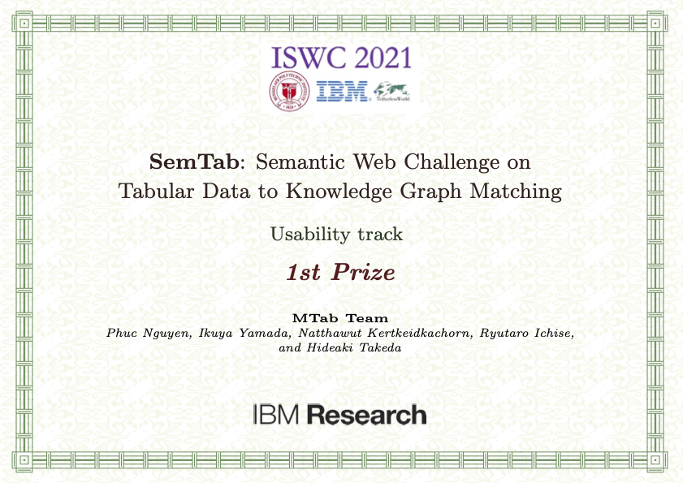
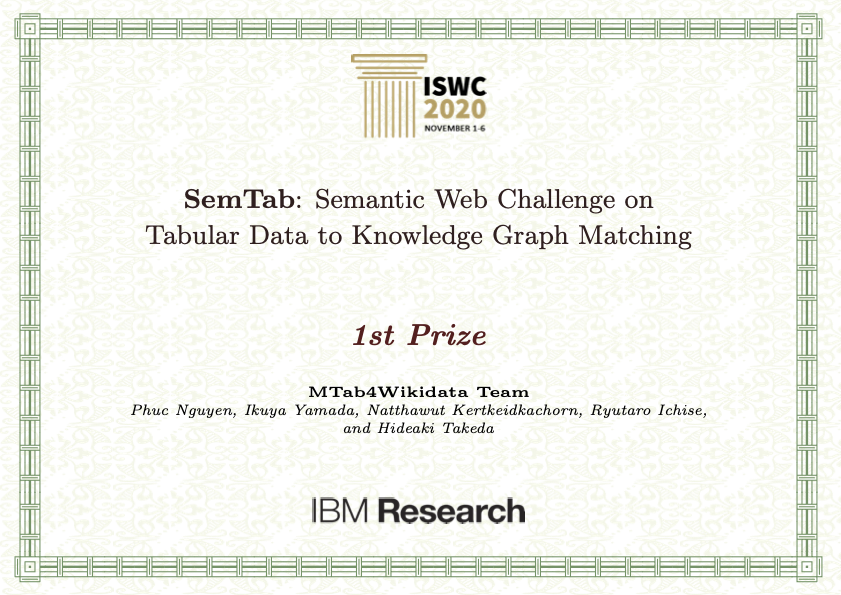
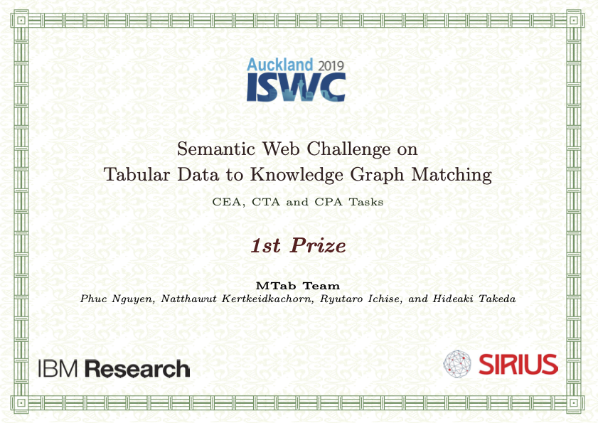

---

MTab: Entity Search and Table Annotation with Knowledge Graphs (Wikidata, Wikipedia and DBpedia)

### Demo
- Demo (Teaser): https://youtu.be/sr-zxH5JUjw
- Demonstration Video: https://youtu.be/0ibTWeObWaA
- Entity Search: https://mtab.kgraph.jp/mtabes
- Table Annotation: https://mtab.kgraph.jp/mtab


### API usage
- Entity Search: [MTabES](docs/mtabes.md)
  - Request Example: [entity search](api/lookup/m_mtabes.py)
- Table Annotation: [MTab](docs/mtab.md)
  - Request Example: [table annotation](api/annotator/m_table_annotation.py)
- Running Table Annotation on Tough Tables (2T) dataset:
  - Running Scripts: [run 2t](https://github.com/phucty/mtab_tool/blob/master/run_2t.py)

### Source code:
- Development code: https://github.com/phucty/mtab_dev

### Other works:
- [MTab4D](https://github.com/phucty/mtab4dbpedia): Table Annotation with DBpedia 
- [WikiDB](https://github.com/phucty/wikidb): Build a DB (key-value store - LMDB style) from Wikidata dump, offline access Wikidata, fast boolean search

### References
- Phuc Nguyen, Ikuya Yamada, Natthawut Kertkeidkachorn, Ryutaro Ichise, Hideaki Takeda, SemTab 2021: Tabular Data Annotation with MTab Tool. [[video](https://www.youtube.com/watch?v=j-l3poE0Ktc)]

- Phuc Nguyen, Ikuya Yamada, Natthawut Kertkeidkachorn, Ryutaro Ichise, Hideaki Takeda, Demonstration of MTab: Tabular Data Annotation with Knowledge Graphs. [[video](https://youtu.be/0ibTWeObWaA)]

- Phuc Nguyen, Hideaki Takeda, MTab: Tabular Data Annotation, NII Open House June 2021. [[video](https://youtu.be/1ByffPp2alg?t=3269)]

- Phuc Nguyen, Ikuya Yamada, Hideaki Takeda, [MTabES: Entity Search with Keyword Search, Fuzzy Search, and Entity Popularities](https://drive.google.com/file/d/10Tl0Qd5gxFSiCsnSjJbvRSUiDXW-Kifn/view?usp=sharing), In The 35th Annual Conference of the Japanese Society for Artificial Intelligence (JSAI), 2021. [[video](https://drive.google.com/file/d/1gYSP619HcMT-sE6iD3LiQeRtZw9UZTWQ/view?usp=sharing)]


- Phuc Nguyen, Ikuya Yamada, Natthawut Kertkeidkachorn, Ryutaro Ichise, Hideaki Takeda, [MTab4Wikidata at SemTab 2020: Tabular Data Annotation with Wikidata](http://ceur-ws.org/Vol-2775/paper9.pdf), In SemTab@ISWC, 2020. [[video](https://drive.google.com/file/d/1vz-6nkc9t6MQZYzgg-PZNLs-9TT86wRD/view?usp=sharing)]

  
- Phuc Nguyen, Natthawut Kertkeidkachorn, Ryutaro Ichise, Hideaki Takeda [MTab: Matching Tabular Data to Knowledge Graph using Probability Models](http://ceur-ws.org/Vol-2553/paper2.pdf), In SemTab@ISWC, 2019, [[slides](http://www.cs.ox.ac.uk/isg/challenges/sem-tab/2019/slides/MTab.pptx)]

  
### Awards:

- 1st prize at SemTab 2021 (usability track). [Results](https://www.cs.ox.ac.uk/isg/challenges/sem-tab/2021/index.html#results)

  
  
- 1st prize at SemTab 2020 (tabular data to Wikidata matching). [Results](http://www.cs.ox.ac.uk/isg/challenges/sem-tab/2020/results.html)
  

- 1st prize at SemTab 2019 (tabular data to DBpedia matching). [Results](http://www.cs.ox.ac.uk/isg/challenges/sem-tab/2019/results.html)
  

### Citing

If you find MTab tool useful in your work, and you want to cite our work, please use the following referencee:
```
@inproceedings{2021_mtab4wikidata,
  author    = {Phuc Nguyen and
               Ikuya Yamada and
               Natthawut Kertkeidkachorn and
               Ryutaro Ichise and
               Hideaki Takeda},
  title     = {SemTab 2021: Tabular Data Annotation with MTab Tool},
  booktitle = {SemTab@ISWC 2021},
  series    = {{CEUR} Workshop Proceedings},
  volume    = {3103},
  pages     = {92--101},
  publisher = {CEUR-WS.org},
  year      = {2021},
  url       = {http://ceur-ws.org/Vol-3103/paper8.pdf},
}
```


### Contact
Phuc Nguyen (`phucnt@nii.ac.jp`)
