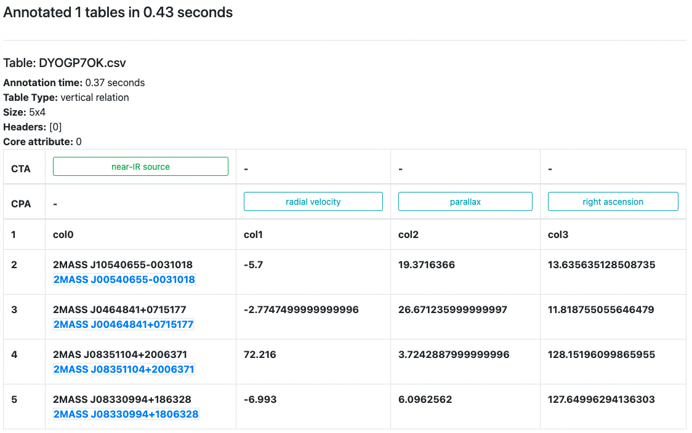

MTab: Tabular Data Annotation
===========
---

**Under development**
### Features:
- Semantic Annotation with knowledge graphs: Wikidata, Wikipedia, DBpedia
    - Cells to Entities: Similar to SemTab CEA task
    - Table attributes to Entity types, or classes. Currently, the tool supports table attributes as table columns. 
    - The relation between table attributes to property. The tool currently supports table attributes as table columns
- Structure Annotation: (under development)
  - Table types: matrix, relational, layout
  - headers
  - core attributes
  - basic stats
  - data types
  - languages
- Good for table interpretation, data integration, and knowledge discovery.

### Interface:
https://mtab.app/mtab

### API URL:
https://mtab.app/api/v1/mtab

### Parameter: 
Currently, the tool only supports the input of the SemTab 2020 challenge, where the tool will accept a zip file with the format like the [mytable.zip](../interface/static/others/mytables.zip) file.
```
mytable.zip
|-- tables (folder)
|   |--0CF12YZK.csv (table with table ID 0CF12YZK)
|   |--K0PM5GMK.csv (table with table ID K0PM5GMK)
|-- cea.csv (Cell annotation targets in the format of [table ID, row index, column index])
|-- cta.csv (Column annotation targets in the format of [table ID, column index])
|-- cpa.csv (The relation between two columns in the format of [table ID, column 1, column 2]
```

Note that: After processing your tables, we will delete your data immediately. 

### Examples:
Making annotations for two tables in [mytable.zip](../interface/static/others/mytables.zip). 
**Command:** 
```bash
% curl -X POST -F file=@"YOUR_ZIP_FILE_LOCATION/mytables.zip" https://mtab.app/api/v1/mtab
```
Expected Answer:

Refer to the [mytables.json](../interface/static/others/mytables.json) as the full answers
```json
{
  "n_tables": 2,
  "status": "Success",
  "tables": [
    {
      "file_name": "0CF12YZK.csv",
      "run_time": 28.576568126678467,
      "semantic": {
        "cea": [
          {
            "annotation": {
              "dbpedia": "http://dbpedia.org/resource/Price,_Utah",
              "wikidata": "http://www.wikidata.org/entity/Q482891",
              "wikipedia": "http://en.wikipedia.org/wiki/Price,_Utah"
            },
            "target": [1,0]
          },
          ...
        ],
        "cpa": [
          {
            "annotation": {
              "wikidata": "http://www.wikidata.org/prop/direct/P4511"
            },
            "target": [0,1]
          },
          ...
        ],
        "cta": [
          {
            "annotation": {
              "dbpedia": "http://dbpedia.org/resource/Impact_crater",
              "wikidata": "http://www.wikidata.org/entity/Q55818",
              "wikipedia": "http://en.wikipedia.org/wiki/Impact_crater"
            },
            "target": 0
          }
        ]
      },
      "structure": {
        "columns": 3,
        "core_attribute": 0,
        "header": [0],
        "missing ratio": 0,
        "row": 45,
        "table type": "vertical relation"
      },
      "table_id": "0CF12YZK"
    },
    {
      "file_name": "K0PM5GMK.csv",
      ...
    }
  ]
}
```

### Other Examples:
#### Table Annotation

#### Data correction:
Input: Tabular data

| col0                    | col1     | col2       | col3       |
|-------------------------|----------|------------|------------|
| 2MASS J10540655-0031018 | -5.7     | 19.3716366 | 13.6356351 |
| 2MASS J0464841+0715177  | -2.77475 | 26.671236  | 11.8187551 |
| 2MAS J08351104+2006371  | 72.216   | 3.7242888  | 128.151961 |
| 2MASS J08330994+186328  | -6.993   | 6.0962562  | 127.649963 |

Output: Annotated data

| [star](http://www.wikidata.org/entity/Q523)                    | [radial velocity](http://www.wikidata.org/prop/direct/P2216) | [parallax](http://www.wikidata.org/prop/direct/P2214) | [right ascension](http://www.wikidata.org/prop/direct/P6257)    |
|-------------------------|-----------------|----------|--------------------|
| [2MASS J00540655-0031018](http://www.wikidata.org/entity/Q222120) | -5.70           | 19.2561  | 13.52741580209200  |
| [2MASS J00464841+0715177](http://www.wikidata.org/entity/Q222110) | -2.75           | 26.6180  | 11.70173767885790  |
| [2MASS J08351104+2006371](http://www.wikidata.org/entity/Q78611172) | 72              | 3.6984   | 128.79594070217040 |
| [2MASS J08330994+1806328](http://www.wikidata.org/entity/Q78610810) | -7              | 6.1146   | 128.29142004157090 |