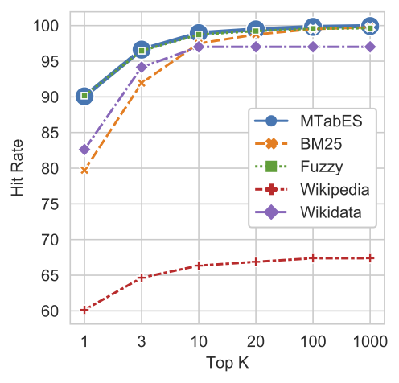
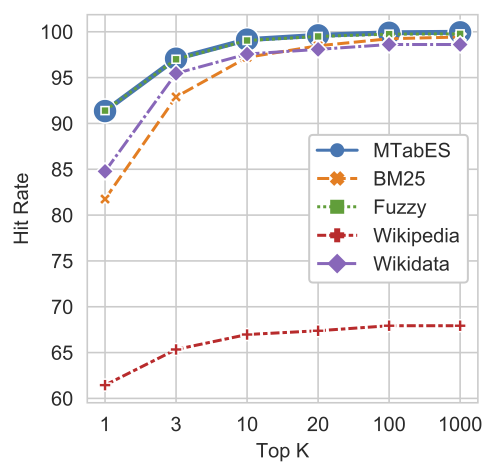
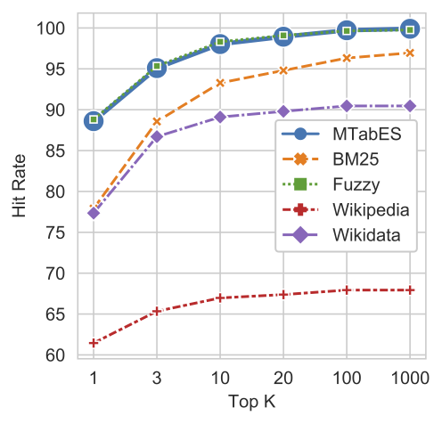
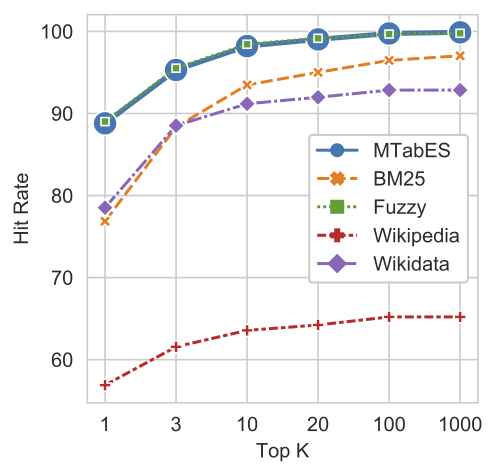
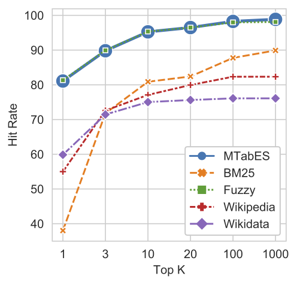

MTabES: Entity Search
===========
---

### Features: 
- The indexed database (entity labels) is a combination of the three Knowledge Graphs: Wikidata, Wikipedia, and DBpedia, including entity labels, aliases, other names, redirect entity labels, and disambiguation entities. There are 249,388,985 labels, 91,216,260 entities at 2021/01/01.
- Multilingual support.
- Work well with noisy text such as misspelling or abbreviation
- Can be used for the tasks of entity search or entity-based OCR post-processing.


### Interface:
https://mtab.app

### API URL:
https://mtab.app/api/v1/search

### Parameter: 
- q: search query. This parameter is required.
- limit: maximum number of relevant entities to return. The value should be from 1 to 1000. The default value is 20.
- m: one of three value [b, f, a]. The default value is a.
    - b: keywords search with BM25 (hyper-parameters: b=0.75, k1=1.2).
    - f: fuzzy search with an edit-distance (Damerau–Levenshtein distance). 
    - a: the weighted aggregation of keyword search and fuzzy search. This model yields slightly better performance (1-3 % accuracy improvement) than fuzzy search.
    
- info: one of two value [0, 1]. The default value is 0.
    - 0: do not return entity labels, description, mapping URLs of DBpedia and Wikipedia.
    - 1: return entity labels, description, mapping URLs of DBpedia and Wikipedia.
- expensive: one of two value [0, 1]. The default value is 0.
    - 0: efficiency mode. Perform early stopping in the fuzzy search. 
    - 1: Brute-force search. This mode could slightly improve search performance (improve 1-2% accuracy), but it might take a long time to get answers (about ten times longer than the efficiency mode).
### Examples:
Searching a query of "2MASS J10540655-0031018". 

Note that: At 2021/01/01, we could not get any answer by using the standard lookup (Wikidata, Wikipedia, DBpedia, or Google Search) 

**Command:** 
```
% curl -X GET "https://mtab.app/api/v1/search?limit=3&m=a&info=1&q=2MASS%20J10540655-0031018"
```
Expected Answer:
```json5
{
  "hits": [
    {
      "des": "brown dwarf",
      "id": "Q222120",
      "label": "2MASS J00540655-0031018",
      "score": 0.39831033397179416,
      "wd": "http://www.wikidata.org/entity/Q222120"
    },
    {
      "des": null,
      "id": "Q87130330",
      "label": "TYC 4151-458-1",
      "score": 0.23949881593395422,
      "wd": "http://www.wikidata.org/entity/Q87130330"
    },
    {
      "des": null,
      "id": "Q89756929",
      "label": "TYC 5033-427-1",
      "score": 0.043365759204671825,
      "wd": "http://www.wikidata.org/entity/Q89756929"
    }
  ],
  "run_time": 1.1118018627166748,
  "status": "Success",
  "total": "3"
}
```
**MTabES Benchmarking:** 

- SemTab 2020 Round 1 
  

- SemTab 2020 Round 2 
  

- SemTab 2020 Round 3 
  

- SemTab 2020 Round 4 
  

- Tough Tables 
  
